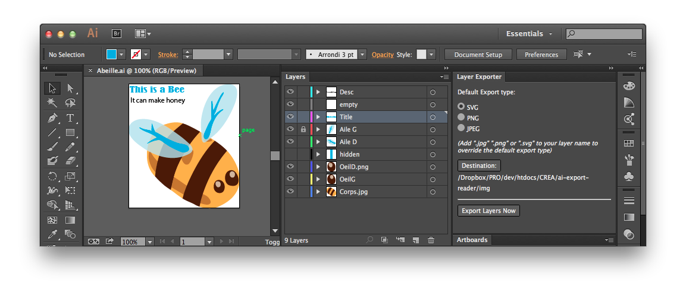
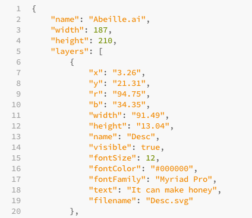
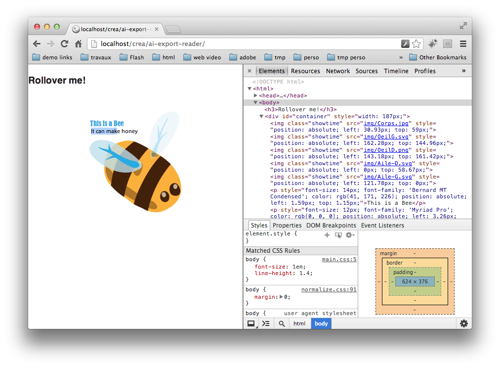

#Layer Exporter for Adobe Illustrator

The simplest way to export your vector assets!

Layer exporter is a free, open source extension panel for Adobe Illustrator CC, made with the [creative cloud extensiblity helpers](http://davidderaedt.github.io/ccext-website/).

###[DOWNLOAD LAYER EXPORTER (BETA)](https://github.com/davidderaedt/Illustrator-Layer-Exporter/blob/master/bin/LayerExporter.zxp)

##Export all Layers at once

- All layers are exported separately in PNG, SVG or JPG files. 
- Override the default export format simply by adding ".png", ".svg" or ".jpg" to the layer name
- Ignore layers you don't want simply by hiding them

##Export layer data

Along with you image files is a JSON file which contains what you need to re-create your composition in your destination platform (web page, mobile application, whatever).

Simply parse the JSON file, and place the image files according to the coordinates. You can even recreate text, since the string, font size, font family and color are also exported.

##Import everything back in your webpage

Since we have all the necessary information in the JSON file, creating a javascript reader for your files should be trivial for any web developer.

[Click here for an example using jquery.](https://github.com/davidderaedt/Illustrator-Layer-Exporter/blob/master/bin/ai-export-reader.zip)

Just export your illustrator layers to the `img` folder, and launch the page from a webserver: your image should be completely recomposed, with each layer represented by a separate `` tag, waiting to be animated.

What's nice is that texts can either be kept as images or converted to pure HTML!

##Q&A

###How do I install that?

Download the ZXP file, and double click it. This should open Extension Manager CC and install it for you.

###Why do I need Illustrator CC? (I want this for my 1989 copy of Illustrator 2.0!)

Sorry, CC apps have a new engine for extensions which lets you create panels using nothing but web standards. This is what this panel uses. You can still port it by yourself, of course.

###I don't use layers in the first place!

Well you should, but you can also simply grab I small script I wrote which automatically distributions all selected elements in layers. You can then just regroup the ones you want.

###Do I have to rename my layers?
Most likely not. Spaces are automatically replaced by "-". However, using special characters will probably make you in trouble.

###What settings are used for SVG files?

Jpeg quality is 90%. I'll find a way to expose this as an option in the future.

For SVG, I use the following settings:

* SVG 1.1 spec
* Embedded raster images
* Outlined text
* Only 2 decimals for coordinates

###Hey, the exported SVG code sucks!

While it does the job, the Illustrator SVG export engine is not so great in the first place. I highly recommend using SVGO for optimization.

###Why doesn't work with my appearances?

Sorry, appearances are not supported at this stage.

###Does it support symbols?

Yes and no. Symbols instances will all be treated as separated image files.

###What about sublayers?
Not supported.